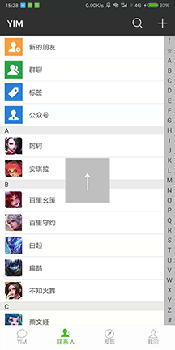
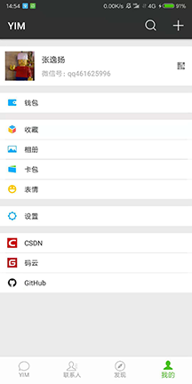
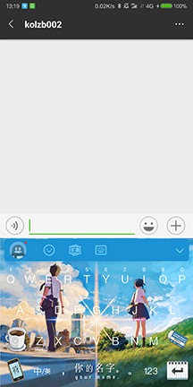
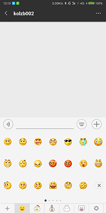
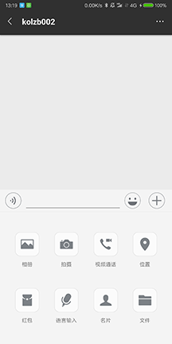
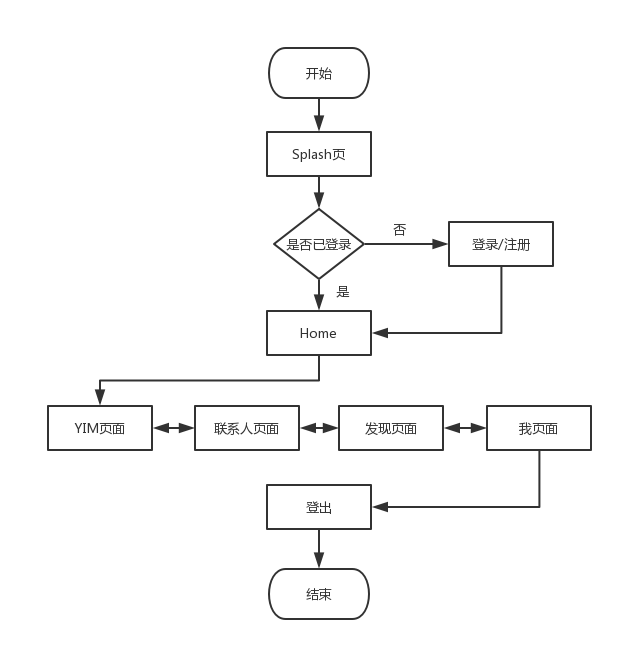
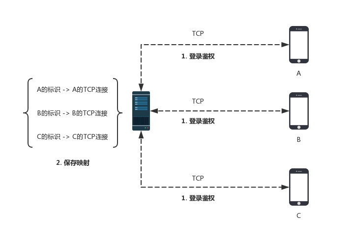
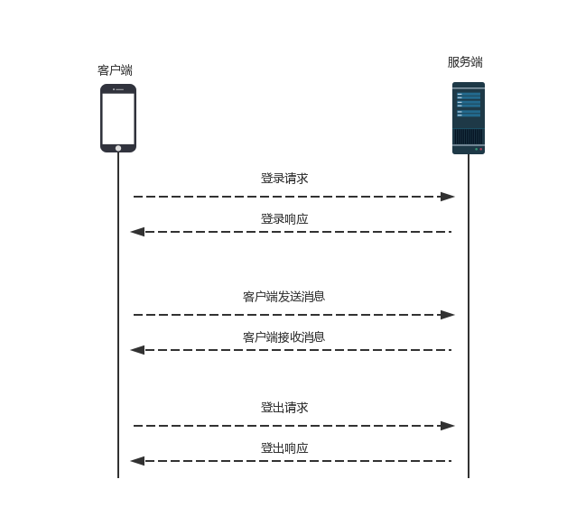

# Yi (YIM) 客户端

## YIM v1.0.2
YIM 是本人基于即时通讯（IM）技术开发的移动端应用。项目设计目标为参考 WeChat 客户端的架构，实现简单登录、注册、登出功能；实现基本文本传输、语音传输、图片传输、文件传输等功能；实现好友系统、单聊（C2C）、群聊（C2G）等功能。仅供个人学习所用。

## 应用截图

### 部分一级跳转页面
   

### 部分二级跳转页面 
   

### 输入控件
  

## 历史版本

| 序号 | 版本号 | 说明 |
| :-: | :-: | - |
| 1 | v1.0.0 | 专业设计提交版本 |
| 2 | v1.0.1 | 新增聊天界面 Emoticon 模块、Toolbar 模块 |
| 3 | v1.0.2 | 专业设计提交版本刻盘版；更新 emoji 表情 |

## 最新版开发环境

1. Android Studio >= 3.1.4
2. Gradel Version: 4.4
3. Android Plugin Version: 3.1.4
4. minSdkVersion：21
5. targetSdkVersion 27

## 相关依赖

	// BottomNavigation：https://github.com/Ashok-Varma/BottomNavigation
    implementation 'com.ashokvarma.android:bottom-navigation-bar:2.0.5'
    implementation 'com.android.support:recyclerview-v7:27.1.1'
    // TinyPinyin核心包：https://github.com/promeG/TinyPinyin
    implementation 'com.github.promeg:tinypinyin:2.0.3'
    // Optional compile for GCM (Google Cloud Messaging).
    implementation 'com.google.android.gms:play-services-gcm:10.2.1'
    implementation 'com.hyphenate:hyphenate-sdk:3.3.0'
	// glide
    implementation 'com.github.bumptech.glide:glide:3.7.0'

## UI 素材

UI素材自个人另一个开源项目：[https://github.com/gdut-yy/OpenUI](https://github.com/gdut-yy/OpenUI)

## 程序流程

### 程序流程
YIM 主要分为四大模块。应用启动后先加载Splash页，然后判断当前账号是否已经自动登录，若没有自动登录，则会跳转到“登录/注册页面”，若已经自动登录，则会从服务端加载账户的相关数据到本地。用户数据加载完成后将自动跳转到“Home页面”。“Home页面”由四个主要的Fragment视图组成，分别是“YIM页面”、“联系人页面”、“发现页面”和“我页面”，可以通过左右滑动来切换不同的页面。
 

### 单聊流程
单聊指的是两个用户之间相互聊天。
 

（1）如图所示，A 要和 B 聊天，首先 A 和 B 需要与服务器建立连接，然后进行一次登录流程，服务端保存用户标识和 TCP 连接的映射关系。

（2）A 发消息给 B，首先需要将带有 B 标识的消息数据包发送到服务器，然后服务器从消息数据包中拿到 B 的标识，找到对应的 B 的连接，将消息发送给 B。

（3）任意一方发消息给对方，如果对方不在线，需要将消息缓存，对方上线之后再发送。

我们把客户端与服务端之间相互通信的数据包称为指令数据包，指令数据包分为指令和数据，每一种指令对应客户端或者服务端的一种操作，数据部分对应的是指令处理需要的数据。

下图展示了若要实现单聊，客户端与服务端分别要实现哪些指令：
 

### 群聊流程
群聊指的是一个组内多个用户之间的聊天，一个用户发到群组的消息会被组内任何一个成员接收，下图展示了群聊的基本流程：
 

如图，要实现群聊，其实和单聊类似：

（1）A，B，C 依然会经历登录流程，服务端保存用户标识对应的 TCP 连接。

（2）A 发起群聊的时候，将 A，B，C 的标识发送至服务端，服务端拿到之后建立一个群聊 ID，然后把这个 ID 与 A，B，C 的标识绑定。

（3）群聊里面任意一方在群里聊天的时候，将群聊 ID 发送至服务端，服务端拿到群聊 ID 之后，取出对应的用户标识，遍历用户标识对应的 TCP 连接，就可以将消息发送至每一个群聊成员。

群聊除了需要实现上述指令之外，还需要实现的指令集如图所示：
 

## 参考资料

	[1] 阿里巴巴集团技术团队著. 码出高效: 阿里巴巴Java开发手册 1.4.0. 电子工业出版社, 2018.
	[2] 淘宝技术团队等著. 阿里巴巴Android开发手册（正式版）. 电子工业出版社, 2018.
	[3] Joshua Bloch著. Effective Java（第3版）. 电子工业出版社, 2018
	[4] Norman Maurer等著. Netty实战. 人民邮电出版社, 2017
	[5] 郭霖著. 第一行代码Android第2版. 人民邮电出版社, 2016
	[6] Bill Phillips, Chris Stewart, Kristin Marsicano等著. Android编程权威指南（第3版）. 中国工信出版集团, 2017.
	[7] 任玉刚著. Android开发艺术探索. 电子工业出版社, 2015.
	[8] 范磊著. Android应用开发进阶. 电子工业出版社, 2018.
	[9] 刘望舒著. Android进阶之光. 电子工业出版社, 2017
	[10] Kevin R.Fall等著. TCP/IP详解 卷1：协议（原书第2版）. 机械工业出版社, 2016
	[11] Google Android 示例库：https://github.com/googlesamples/android-sunflower
	[12] 环信即时通讯云开发文档：https://www.easemob.com/ 
	[13] BottomNavigation开源组件：https://github.com/Ashok-Varma/BottomNavigation
	[14] LQRWeChat开源项目：https://github.com/GitLqr/LQRWeChat
	[15] 泛聊开源项目：https://github.com/uncleleonfan/FanChat
	[16] 汉字转拼音库：https://github.com/promeG/TinyPinyin